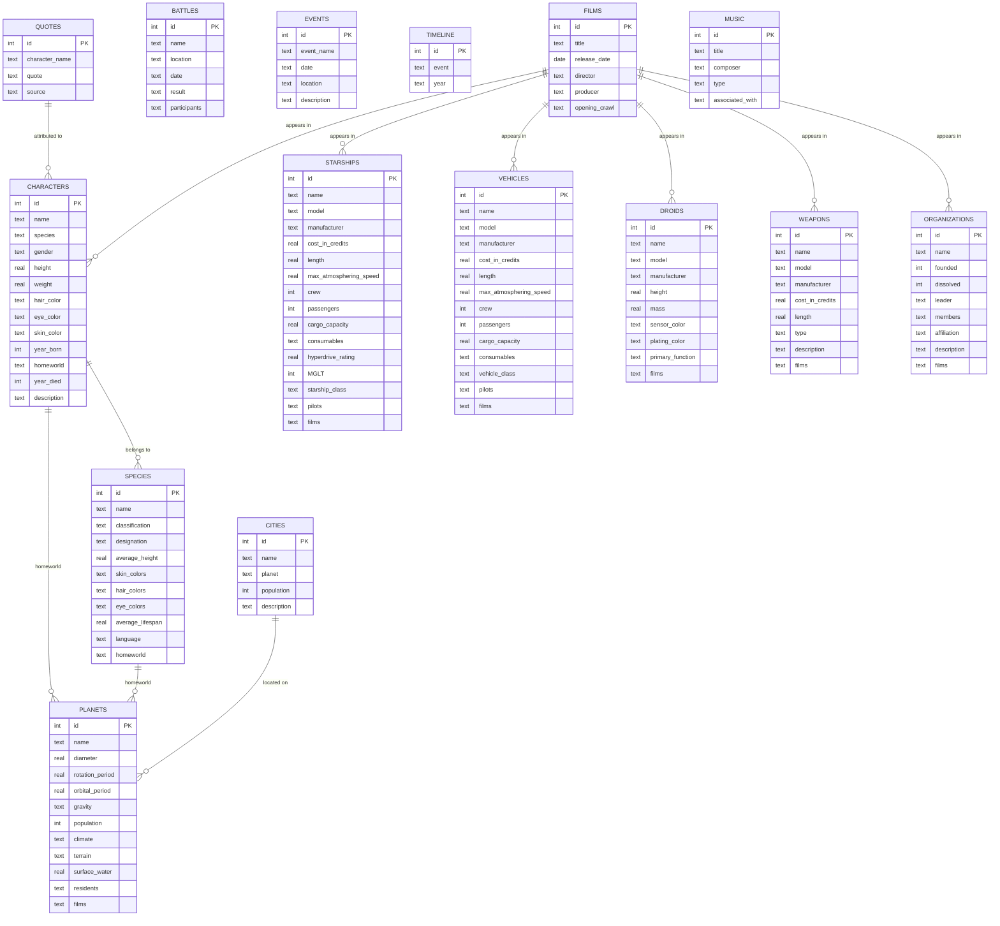

# Star Wars Database ERD

## Mermaid Entity Relationship Diagram

## Key Relationships

1. **Characters** → **Species**: Characters belong to species
2. **Characters** → **Planets**: Characters have homeworlds
3. **Species** → **Planets**: Species have homeworlds
4. **Cities** → **Planets**: Cities are located on planets
5. **Films**: Central entity referenced by many tables (characters, starships, vehicles, droids, weapons, organizations)
6. **Pilots**: Referenced in starships and vehicles (likely character names)
7. **Quotes** → **Characters**: Quotes are attributed to characters
8. **Battles/Events**: Location-based entities that may reference planets

## Entity Summary

- **Core Entities**: Characters, Species, Planets, Films
- **Vehicles & Technology**: Starships, Vehicles, Droids, Weapons
- **Organizations & Events**: Organizations, Battles, Events, Timeline
- **Locations**: Cities, Planets
- **Media**: Films, Music, Quotes

Note: Many relationships are stored as text fields (e.g., pilots, films, members) rather than proper foreign keys, indicating a denormalized design.
